# Battleships

[View the live project here](https://my-battleship-game-86778a82a963.herokuapp.com/)

## Overview
This classic game of Battleships is my third portfolio project and focuses on the Python programming language. 

The game is played on a 6 x 6 grid. The computer will place five ships on random squares within the grid. The player has ten guesses to try and sink the five ships. 

The game is customisable and additional ships and/or play turns can be easily amended within the code. 

After each guess the player will be told how many missiles they have left. If the player guesses a previously guessed location, then a message will prompt the player to select another location.

Player's will be notified when they hit a ship, and this will also be marked with an 'x' on the game board. 

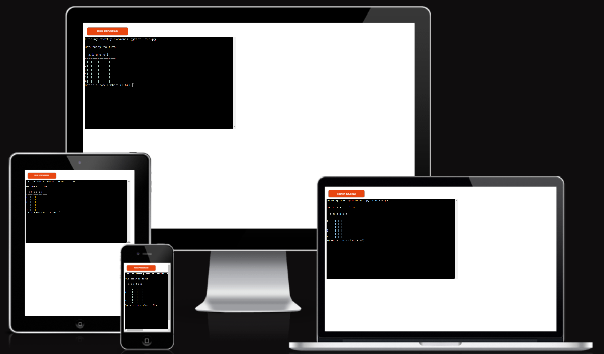

## User Experience (UX) 

### First Time Visitors
As a user of this site, I want to: 

* Easily understand the main purpose of the game.
* Want to play a game which is quick and easy.
* I want a game that is visually appealing and fun.
* I want to be able to easily track score.

### Returning Visitors
* As a returning visitor I want to be able to be able to enjoy the same game.

### Frequent user
* I want to see if I can continue to post personal best scores.

## Features

### Main page 

* From the Python terminal press Run Program. From here you will first guess a row number (1 - 6) and then a column letter (A - F).

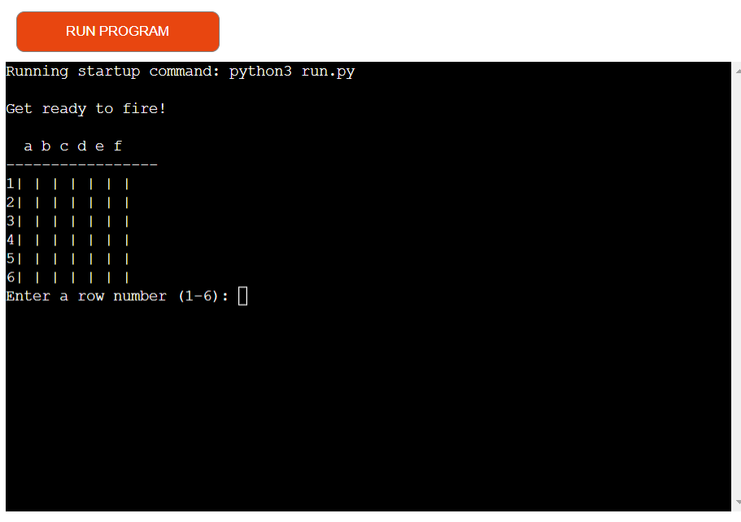

* A miss will be highlighted to the player and a 'o' symbol will appear on the game board.

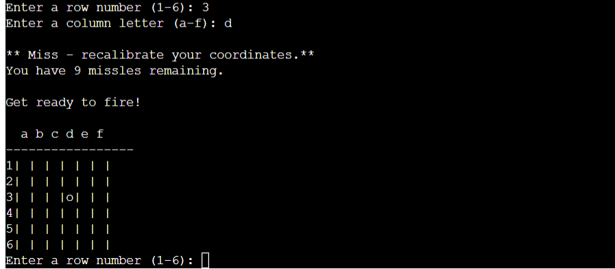

* A hit will be highlighted to the player and a 'x' symbol will appear on the game board. 

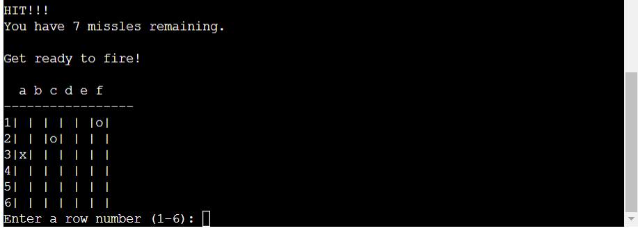

* A message will be displayed to the player when all their missiles have been used up.

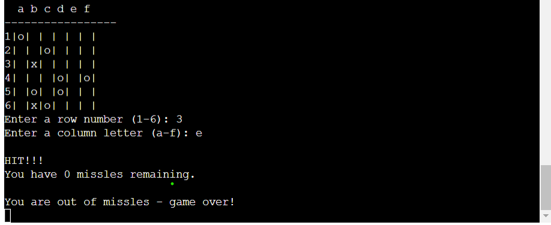

### Additional features to include 
The list of additional features to be added later include:

* Options to play a 1 vs 1 against the computer.
* A 'play again' function.
* Options to customise how many ships need to be hit to win the game.

## Technologies used
The following technologies were used for this site:

* GitPod Enterprise was used for coding the site and version control.
* GitHub as the repository for the projects code.
* Heroku was used to host the application.
* CI Python Linter validation for Python code

## Testing

###
|Features|Test Conducted|Expected Outcome|Test Outcome|
|:----|:----|:----|:----|
|Correct message displayed when missile misses ship|Miss - recalibrate your coordinates|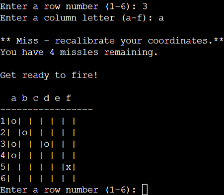|Pass|
|Correct message displayed when missile hits ship|HIT!!!|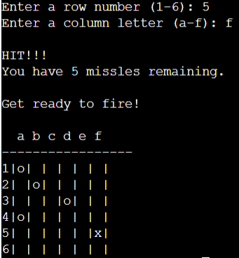|Pass|
|Message displayed when the player guesses an already guessed square|Already guessed here - guess elsewhere|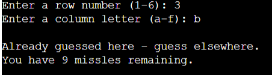|Pass|
|Number of missiles left|Reduces by 1|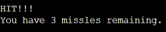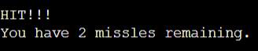|Pass|
|Game over message|You are out of missiles - game over!||Pass|

### Code validation
|Page Tested|Screenshot of Errors|Solution Applied|Screenshot of Clear Validator Output|Test Outcome|
|:----|:----|:----|:----|:----|
|run.py|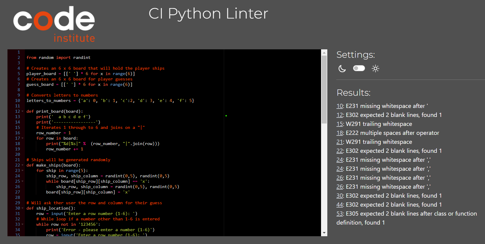|Made each amend as highlighted|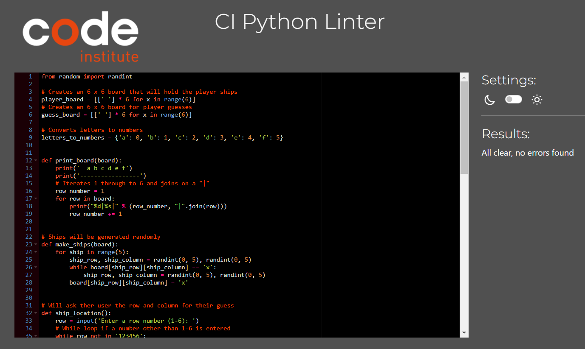|Pass|

### Bugs
|Bug|Image|Solution applied|Image|
|:----|:----|:----|:----|
|When printing the game boards the output was not as expected|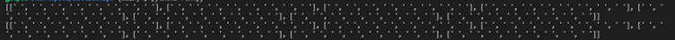|The Print statements were added directly below the print_board function. To rectify this, they were added below the make_ships function|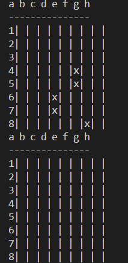|
|Error in the code when checking if all missiles have been used up|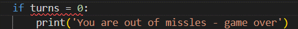|The code was missing an "="|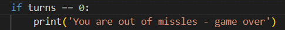|
|No space after entering a row number and column letter|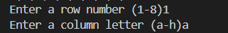|There were no spaces after the row and column inputs. To rectify this a space was added|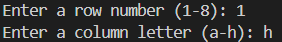|

## Deployment 
### Deploying the site
After creating the website in GitPod Enterprise, the site was deployed to Heroku to host. To deploy the project, use the following steps:
* Fork or clone this repository
* Create a new Heroku app
* Set the buildbacks to Python and Node JS in that order
* Link the Heroku app to the repository
* Click on Deploy

## Credits

### Code
* [Knowledge Mavens - How to Code Battleship in Python](https://www.youtube.com/@KnowledgeMavens). 
* [Deployment section of README - Code Institute ULTIMATE Battleships README](https://learn.codeinstitute.net/courses/course-v1:CodeInstitute+PE_PAGPPF+2021_Q2/courseware/b3378fc1159e43e3b70916fdefdfae51/605f34e006594dc4ae19f5e60ec75e2e/).

 
